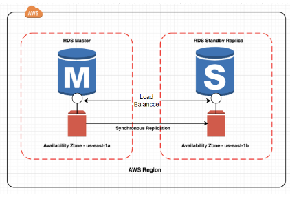
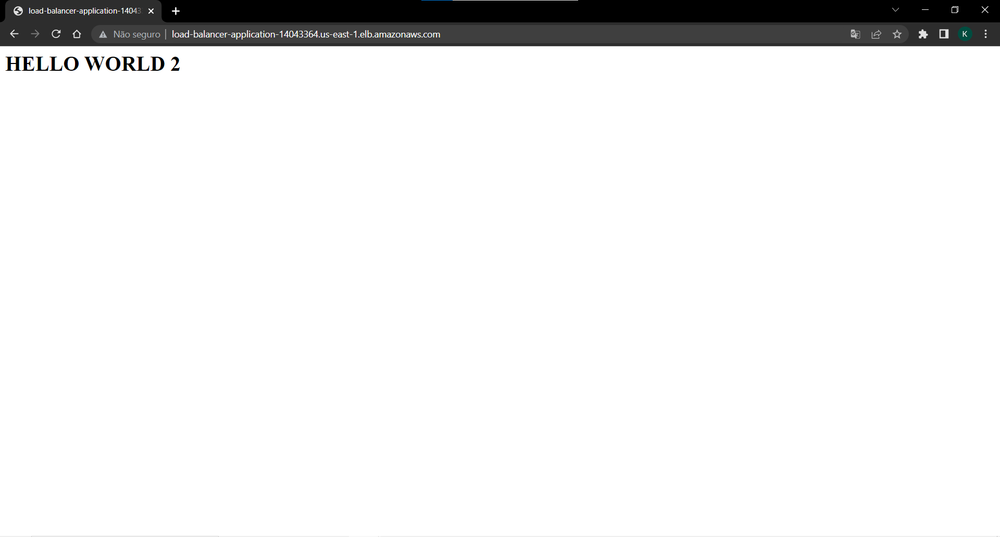
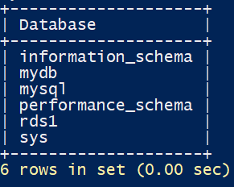

# Projeto_Cloud

## 1. Introdução
Esse projeto tem como objetivo criar dois RDSs (em zonas diferentes) e um Load Balancer com dois EC2 e no final conecta-los, usando os Web Server (EC2) para enviar os dados nos RDSs. Tudo feito em Terradorm.

&nbsp;&nbsp;&nbsp;&nbsp;&nbsp;&nbsp;&nbsp;&nbsp;&nbsp;&nbsp;&nbsp;&nbsp;&nbsp;&nbsp;&nbsp;&nbsp;&nbsp;&nbsp;&nbsp;&nbsp;&nbsp;&nbsp;&nbsp;&nbsp;&nbsp;&nbsp;&nbsp;&nbsp;&nbsp;&nbsp;&nbsp;&nbsp;&nbsp;&nbsp;&nbsp;&nbsp;&nbsp;&nbsp;&nbsp;&nbsp;&nbsp;&nbsp;&nbsp;&nbsp;&nbsp;&nbsp;&nbsp;&nbsp;&nbsp;&nbsp;&nbsp;&nbsp;&nbsp;&nbsp;&nbsp;&nbsp;&nbsp;&nbsp;&nbsp;&nbsp;&nbsp;&nbsp;&nbsp;

Mas antes, precisamos entender o que são esses serviços mencionados anteriormente: 

- **Load Balancer** : esse serviço tem como objetivo direcionar as solicitações entre os servidores conectados a ele, assim evitando a sobrecarga dos outro serviços.
- **EC2** : junto com a criação do Load Balancer, dois EC2 são implementandos juntos. Aqui no projeto seriam os servidores (Web Servers).
- **RDS** : são os bancos de dados, no projeto tem o objetivo de armazenar os dados enviados pelos EC2.

## 2. Primeiros passos
- Baixar o [Terraform](https://youtu.be/Cn6xYf0QJME)
- Cria um user [AWS IAM USER](https://youtu.be/LhAyqaZwYKE)
- Baixar, set up iniciais e configurar no seu computador a [AWS CLI](https://youtu.be/XxTcw7UTues)
- Criar SSH keys_pair no Windows:

Passo 1: gerar keys_pair
```
ssh-keygen -t rsa -b 4096
```

Passo 2: vá para o diretório dos usuários
```
C:\Users\YourUsername
```

Passo 3: ir ao diretório .ssh
```
cd C:\Users\YourUsername\.ssh
```

Passo 4: copiar e colar o key_pairs em algum lugar
```
cat id_rsa.pub
```

## 3. Criando os primeiros arquivos
Antes de implementar os serviços, precisamos criar alguns arquivos para configurar o projeto:
- **variables.tf**
```terraform
variable "access_key" {}

variable "secret_key" {}

variable "region" {
    default = "us-east-1"
}

variable "key_pair" {}

variable "user" {}

variable "password" {}
```
Na hora de dar o **terraform.apply**, você precisará preencher o *access_key*, *secret_key*, *key_pairs* (SSH key_pair) e *user* que foram criados no começo, porém você precisa escolher uma senha para os RDSs. E nesse projeto vamos criar os serviços  na região us-east-1 (Norte Virgínia), mencionado em "region".

**iamgem**

- **provider.tf**

```terraform
provider "aws" {
    region = "${var.region}"
    access_key = "${var.access_key}"
    secret_key = "${var.secret_key}"
}
```
Preenchidos anteriormente, os valores colocados serão encaixados nessas variáveis, com intuito de criar um provedor AWS na região definida com as permissões
das chaves.

- **key_pairs.tf**
```terraform
resource "aws_key_pair" "deployer" {
  key_name   = "deployer-key"
  public_key = "${var.key_pair}"
}
```
No **key_pairs** é criado um par de chaves para autenticar e acessar as instâncias EC2 na AWS. O public-key é o SSH key_pair que foi criado no início e selecionado na hora de rodar.

## 4. Configurações dos serviços
- **az.tf**
```terraform
data "aws_availability_zones" "available_zones" {}

resource "aws_default_subnet" "az1" {
  availability_zone = data.aws_availability_zones.available_zones.names[0] 
}

resource "aws_default_subnet" "az2" {
  availability_zone = data.aws_availability_zones.available_zones.names[1] 
}
```
Nesse arquivo é criado duas subnets padrão em duas zonas diferentes. No caso do projeto são us-east-1a e us-east-1b. Assim podemos, escolher entre as duas onde cada serviço deve ficar.

- **subnetgroup.tf**
```terraform
resource "aws_db_subnet_group" "db_subnet_group_1" {
  name         = "db_subnets_1"
  subnet_ids   = [aws_default_subnet.az1.id, aws_default_subnet.az2.id]
  description  = "database subnets"

  tags   = {
    Name = "db_subnets_1"
  }
}

resource "aws_db_subnet_group" "db_subnet_group_2" {
  name         = "db_subnets_2"
  subnet_ids   = [aws_default_subnet.az1.id, aws_default_subnet.az2.id]
  description  = "database subnets"

  tags   = {
    Name = "db_subnets_2"
  }
}
```
Aqui são criados os grupos subnets para os RDSs. 

***obs*** : subnet_ids precisa receber dois elementos.

- **securitygroup.tf**
```terraform
resource "aws_default_vpc" "default_vpc" {
  tags = {
    Name = "Default VPC"
  }
}

resource "aws_security_group" "web_server" {
  name = "web_server"
  vpc_id = aws_default_vpc.default_vpc.id

  ingress {
    from_port = 80
    to_port = 80
    protocol = "tcp"
    cidr_blocks = ["0.0.0.0/0"]
  }

  ingress {
    from_port = 22
    to_port = 22
    protocol = "tcp"
    cidr_blocks = ["0.0.0.0/0"]
  }

  egress {
    from_port = 0
    to_port = 0
    protocol = "-1"
    cidr_blocks = ["0.0.0.0/0"]
  }
}

resource "aws_security_group" "db_security_group" {
  name        = "database security group"
  vpc_id      = aws_default_vpc.default_vpc.id

  ingress {
    description      = "mysql/aurora access"
    from_port        = 3306
    to_port          = 3306
    protocol         = "tcp"
    security_groups  = [aws_security_group.web_server.id]
  }

  egress {
    from_port        = 0
    to_port          = 0
    protocol         = -1
    cidr_blocks      = ["0.0.0.0/0"]
  }

  tags   = {
    Name ="database security group"
  }
}
```
No começo do código é criado um vpc padrão para ser utilizado nos grupos de segurança. Depois é criado um grupo de segurança para o web server que permite o tráfego entre a porta 80 (tcp) e 22 (ssh). Logo em seguida é criado o grupo de segurança dos RDSs que permite o tráfego da porta 3306 (tcp) vindo do grupo de seguranca dos web servers.

## 5. Criando os serviços 
- **rds1.tf**
``` terraform
resource "aws_db_instance" "db_instance_1" {
  engine                  = "mysql"
  engine_version          = "8.0.31"
  multi_az                = false
  identifier              = "rds-instance-1"
  username                = "${var.user}"
  password                = "${var.password}"
  instance_class          = "db.t2.micro"
  allocated_storage       = 200
  db_subnet_group_name    = aws_db_subnet_group.db_subnet_group_1.name
  vpc_security_group_ids  = [aws_security_group.db_security_group.id]
  availability_zone       = data.aws_availability_zones.available_zones.names[0]
  db_name                 = "rds1"
  skip_final_snapshot     = true
}
```
Aqui é criado um dos RDSs. No availability_zone é definido em qual zona ficar.

- **rds2.tf**
``` terraform
resource "aws_db_instance" "db_instance_2" {
  engine                  = "mysql"
  engine_version          = "8.0.31"
  multi_az                = false
  identifier              = "rds-instance-2"
  username                = "${var.user}"
  password                = "${var.password}"
  instance_class          = "db.t2.micro"
  allocated_storage       = 200
  db_subnet_group_name    = aws_db_subnet_group.db_subnet_group_2.name
  vpc_security_group_ids  = [aws_security_group.db_security_group.id]
  availability_zone       = data.aws_availability_zones.available_zones.names[1]
  db_name                 = "rds2"
  skip_final_snapshot     = true
}
```
Mesmo do primeiro, porém é um outro RDS em uma zona diferente.

- **instance.tf**
``` terraform
resource "aws_instance" "web_server_1" {
  ami = "ami-01cc34ab2709337aa"
  instance_type = "t2.micro"
  count = 1
  subnet_id = aws_default_subnet.az1.id
  key_name = aws_key_pair.deployer.id
  vpc_security_group_ids = [aws_security_group.web_server.id]
  user_data = <<-EOF
    
    #!/bin/bash
    sudo su
    yum update
    yum install httpd -y
    sudo yum install -y mysql
    systemctl start httpd
    systemctl enable httpd
    echo "<html><h1> HELLO WORLD 1 </p> </h1>" > /var/www/html/index.html
    EOF

  tags = {
    Name = "instance-${count.index}"
  }
}

resource "aws_instance" "web_server_2" {
  ami = "ami-01cc34ab2709337aa"
  instance_type = "t2.micro"
  count = 1
  subnet_id = aws_default_subnet.az2.id
  key_name = aws_key_pair.deployer.id
  vpc_security_group_ids = [aws_security_group.web_server.id]
  user_data = <<-EOF
    
    #!/bin/bash
    sudo su
    yum update
    yum install httpd -y
    sudo yum install -y mysql
    systemctl start httpd
    systemctl enable httpd
    echo "<html><h1> HELLO WORLD 2 </p> </h1>" > /var/www/html/index.html
    EOF

  tags = {
    Name = "instance-${count.index}"
  }
}
```
Esse arquivo cria as intâncias dos web servers. Cada instância está em uma subnet diferente, assim são implementados em zonas diferentes. Além disso, o key_pairs definida no início será utilizado aqui. Vale destacar que o vpc_security_group_id é o id do grupo de segurança dos web servers. 

Dentro dessas instâncias é criado em bash o que queremos que seja feita nos web servers. A instância instala o httpd e mysql e apresenta "HELLO WORLD 1" (na primeira instância) e "HELLO WORLD 2" (na segunda instância).

- **alb.tf**
``` terraform
resource "aws_lb_target_group" "target_group_1" {
    health_check {
      interval = 10
      path = "/"
      protocol = "HTTP"
      timeout = 5
      healthy_threshold = 5
      unhealthy_threshold = 2
    }

    name = "target-group-1"
    port = 80
    protocol = "HTTP"
    target_type = "instance"
    vpc_id = aws_default_vpc.default_vpc.id
}

resource "aws_lb" "load_balancer1" {
    name = "load-balancer-application"
    internal = false
    ip_address_type = "ipv4"
    load_balancer_type = "application"
    security_groups = [aws_security_group.web_server.id]
    subnets = [aws_default_subnet.az1.id,aws_default_subnet.az2.id]

    tags = {
      Name = "load-balancer-application"
    }
}

resource "aws_lb_listener" "lb_listener_1" {
    load_balancer_arn = aws_lb.load_balancer1.arn
    port = 80
    protocol = "HTTP"
    default_action {
      target_group_arn = aws_lb_target_group.target_group_1.arn
      type = "forward"
    }
}

resource "aws_lb_target_group_attachment" "attch_1" {
    count = length(aws_instance.web_server_1)
    target_group_arn = aws_lb_target_group.target_group_1.arn
    target_id = aws_instance.web_server_1[count.index].id
  
}

resource "aws_lb_target_group_attachment" "attch_2" {
    count = length(aws_instance.web_server_2)
    target_group_arn = aws_lb_target_group.target_group_1.arn
    target_id = aws_instance.web_server_2[count.index].id
  
}
```
O arquivo começa com a criação do "aws_lb_target_group" do Load Balancer, onde é definido a entrega do tráfego na porta 80. Em seguida é criado o Load Balancer do tipo "application" (que tem como intuito específico de distribuir o tráfego entre os web servers). Vale destacar que o grupo de segurança e as subnet do Load Balancer são as mesma dos Web Servers. Logo abaixo é criado um "aws_lb_listener" para definir como as solicitações serão encaminhadas, também na porta 80. Por fim, são criados dois "aws_lb_target_group_attachment", com seus respectivos Web Server, para anexar as instâncias e o "aws_lb_target_group".

## 6. Resultados
- **output.tf**
``` terraform
output "dns-name" {
  value = aws_lb.load_balancer1.dns_name
}

output "instance_ip_addr_web_server_1"{
  value = aws_instance.web_server_1.*.public_ip
}

output "instance_ip_addr_web_server_2"{
  value = aws_instance.web_server_2.*.public_ip
}

output "endpoint_rds_1" {
  value = split(":", aws_db_instance.db_instance_1.endpoint)[0]
}

output "endpoint_rds_2" {
  value = split(":", aws_db_instance.db_instance_2.endpoint)[0]
}
```

O arquivo mostrará, após realizar o **terraform apply** e criar os serviços, no terminal apresentará o DNS do Load Balancer, as IPs Públicas dos Web Servers e os endpoints dos RDSs.

Agora vamos rodar o código:

Primeiro vamos fazer **terraform init**:
```
terraform init
```

E logo em seguida vamos dar o **terraform apply**
```
terraform apply
```

Ao colocar o DNS do Load Balancer, provavelmente um dos Web Servers aparecerá:

&nbsp;&nbsp;&nbsp;&nbsp;&nbsp;&nbsp;&nbsp;&nbsp;&nbsp;&nbsp;&nbsp;&nbsp;&nbsp;&nbsp;&nbsp;&nbsp;&nbsp;&nbsp;&nbsp;&nbsp;&nbsp;&nbsp;&nbsp;&nbsp;&nbsp;&nbsp;&nbsp;&nbsp;&nbsp;&nbsp;&nbsp;&nbsp;&nbsp;&nbsp;&nbsp;&nbsp;&nbsp;&nbsp;&nbsp;&nbsp;&nbsp;&nbsp;&nbsp;&nbsp;&nbsp;&nbsp;&nbsp;&nbsp;&nbsp;&nbsp;&nbsp;&nbsp;&nbsp;&nbsp;&nbsp;&nbsp;&nbsp;&nbsp;&nbsp;&nbsp;&nbsp;&nbsp;&nbsp;

&nbsp;&nbsp;&nbsp;&nbsp;&nbsp;&nbsp;&nbsp;&nbsp;&nbsp;&nbsp;&nbsp;&nbsp;&nbsp;&nbsp;&nbsp;&nbsp;&nbsp;&nbsp;&nbsp;&nbsp;&nbsp;&nbsp;&nbsp;&nbsp;&nbsp;&nbsp;&nbsp;&nbsp;&nbsp;&nbsp;&nbsp;&nbsp;&nbsp;&nbsp;&nbsp;&nbsp;&nbsp;&nbsp;&nbsp;&nbsp;&nbsp;&nbsp;&nbsp;&nbsp;&nbsp;&nbsp;&nbsp;&nbsp;&nbsp;&nbsp;&nbsp;&nbsp;&nbsp;&nbsp;&nbsp;&nbsp;&nbsp;&nbsp;&nbsp;&nbsp;&nbsp;&nbsp;&nbsp;

Por ser um serviço Load Balancer, onde tráfego distribuído, um dos Web Servers aparecerá. Portanto para apresentar o outro precisrá recarregar a página algumas vezes. 

Agora vamos entra em um dos RDSs:

Primeiro vamos fazer um túnel: 
```
ssh ec2-user@<ip do web server 1>
```

Depois vamos entrar no RDS 1 e depois coloque a senha do RDS que você definiu no começo:
```
mysql -h <endpoint RDS 1> -P 3306 -u <user> -p
```

Vamos criar um database:
```
CREATE DATABASE MYDB;
```

Vamos ver se funcionou
```
SHOW DATABASES;
```



Se apareceu o **mydb** deu certo.
