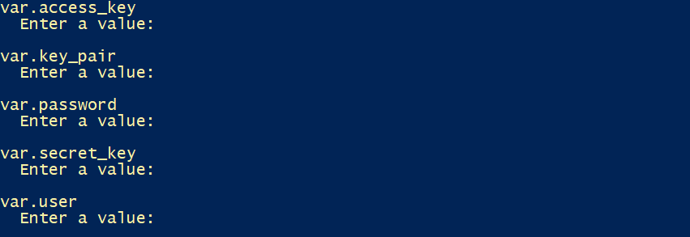

# Projeto_Cloud

## 1. Introdução
Este projeto tem como objetivo a criação de dois Relational Database Service (RDS) em zonas distintas, juntamente com um Load Balancer contendo dois EC2. Ao final, ocorrerá a interconexão desses componentes, utilizando os Web Servers (EC2) para enviar os dados aos RDSs. Todo o processo será implementado utilizando a ferramenta Terradorm.

&nbsp;&nbsp;&nbsp;&nbsp;&nbsp;&nbsp;&nbsp;&nbsp;&nbsp;&nbsp;&nbsp;&nbsp;&nbsp;&nbsp;&nbsp;&nbsp;&nbsp;&nbsp;&nbsp;&nbsp;&nbsp;&nbsp;&nbsp;&nbsp;&nbsp;&nbsp;&nbsp;&nbsp;&nbsp;&nbsp;&nbsp;&nbsp;&nbsp;&nbsp;&nbsp;&nbsp;&nbsp;&nbsp;&nbsp;&nbsp;&nbsp;&nbsp;&nbsp;&nbsp;&nbsp;&nbsp;&nbsp;&nbsp;&nbsp;&nbsp;&nbsp;&nbsp;&nbsp;&nbsp;&nbsp;&nbsp;&nbsp;&nbsp;&nbsp;&nbsp;&nbsp;&nbsp;&nbsp;

Mas antes, precisamos entender o que são esses serviços mencionados anteriormente: 

- **Load Balancer** : Tem como objetivo direcionar as solicitações entre os servidores conectados a ele, evitando a sobrecarga em outros serviços. Distribuindo o tráfego de entrada de maneira equilibrada entre os servidores disponíveis, 
- **EC2** : Em conjunto com a implantação do Load Balancer, são provisionados dois EC2 simultaneamente. Esses EC2 desempenham a função de servidores (Web Servers) no contexto deste projeto.
- **RDS** : Representam os bancos de dados que são implementados com o objetivo de armazenar os dados enviados pelos servidores (EC2). Eles servem como repositórios para as informações processadas pelos EC2, proporcionando armazenamento e persistência aos dados gerados pelo sistema.

## 2. Primeiros passos
- Baixar o [Terraform](https://youtu.be/Cn6xYf0QJME)
- Cria um user [AWS IAM USER](https://youtu.be/LhAyqaZwYKE)
- Baixar, set up iniciais e configurar no seu computador a [AWS CLI](https://youtu.be/XxTcw7UTues)
- Criar SSH keys_pair no Windows:

Passo 1: gerar keys_pair
```
ssh-keygen -t rsa -b 4096
```

Passo 2: vá para o diretório dos usuários
```
C:\Users\YourUsername
```

Passo 3: ir ao diretório .ssh
```
cd C:\Users\YourUsername\.ssh
```

Passo 4: copiar e colar o key_pairs em algum lugar
```
cat id_rsa.pub
```

## 3. Criando os primeiros arquivos
Antes de implementar os serviços, precisamos criar alguns arquivos para configurar o projeto:

- **variables.tf**

Aqui são definidas as variáveis que precisamos preencher ao rodar o código, porém o "region" já está definido. Ou seja, os serviços estarão na região de Norte Virgínia (us-east-1).
```terraform
variable "access_key" {}

variable "secret_key" {}

variable "region" {
    default = "us-east-1"
}

variable "ssh_key_pair" {}

variable "user" {}

variable "password" {}
```

- **provider.tf**

Uma vez que os valores tenham sido preenchidos previamente, essas variáveis serão utilizadas para configurar um provedor AWS no Terraform. O provedor será criado na região especificada e utilizará as chaves de acesso e permissões  para autenticar e autorizar as operações realizadas na infraestrutura da AWS. 
```terraform
provider "aws" {
    region = "${var.region}"
    access_key = "${var.access_key}"
    secret_key = "${var.secret_key}"
}
```

- **key_pairs.tf**

No parâmetro ***key_pairs***, um par de chaves é criado para autenticar e acessar as instâncias EC2 na AWS. O valor do parâmetro ***key_pairs*** corresponde à chave pública (public_key) do SSH key_pair criado anteriormente e selecionado durante a execução. Essa chave pública será associada às instâncias EC2 criadas pelo Terraform, permitindo o acesso seguro por meio do protocolo SSH. A chave privada correspondente ao SSH key_pair é mantida localmente e utilizada para autenticação ao se conectar às instâncias EC2.
```terraform
resource "aws_key_pair" "deployer" {
  key_name   = "deployer-key"
  public_key = "${var.ssh_key_pair}"
}
```


## 4. Configurações dos serviços
- **az.tf**

Neste arquivo, são criadas duas subnets padrão em duas zonas de disponibilidade distintas. No contexto específico do projeto, as zonas selecionadas são us-east-1a e us-east-1b.
```terraform
data "aws_availability_zones" "available_zones" {}

resource "aws_default_subnet" "az1" {
  availability_zone = data.aws_availability_zones.available_zones.names[0] 
}

resource "aws_default_subnet" "az2" {
  availability_zone = data.aws_availability_zones.available_zones.names[1] 
}
```


- **subnetgroup.tf**

Aqui são criados os grupos subnets para os RDSs. 
```terraform
resource "aws_db_subnet_group" "db_subnet_group_1" {
  name         = "db_subnets_1"
  subnet_ids   = [aws_default_subnet.az1.id, aws_default_subnet.az2.id]
  description  = "database subnets"

  tags   = {
    Name = "db_subnets_1"
  }
}

resource "aws_db_subnet_group" "db_subnet_group_2" {
  name         = "db_subnets_2"
  subnet_ids   = [aws_default_subnet.az1.id, aws_default_subnet.az2.id]
  description  = "database subnets"

  tags   = {
    Name = "db_subnets_2"
  }
}
```


***obs*** : subnet_ids precisa receber dois elementos.

- **securitygroup.tf**

No início do código, é criado um VPC padrão que será utilizado como base para os grupos de segurança. Em seguida, é criado um grupo de segurança específico (***web_server***) para os servidores web, que permite o tráfego nas portas 80 (TCP) e 22 (SSH). Logo após, é criado o grupo de segurança para os bancos de dados RDSs (***db_security_group***), que permite o tráfego na porta 3306 (TCP) vindo do grupo de segurança dos servidores web.

```terraform
resource "aws_default_vpc" "default_vpc" {
  tags = {
    Name = "Default VPC"
  }
}

resource "aws_security_group" "web_server" {
  name = "web_server"
  vpc_id = aws_default_vpc.default_vpc.id

  ingress {
    from_port = 80
    to_port = 80
    protocol = "tcp"
    cidr_blocks = ["0.0.0.0/0"]
  }

  ingress {
    from_port = 22
    to_port = 22
    protocol = "tcp"
    cidr_blocks = ["0.0.0.0/0"]
  }

  egress {
    from_port = 0
    to_port = 0
    protocol = "-1"
    cidr_blocks = ["0.0.0.0/0"]
  }
}

resource "aws_security_group" "db_security_group" {
  name        = "database security group"
  vpc_id      = aws_default_vpc.default_vpc.id

  ingress {
    description      = "mysql/aurora access"
    from_port        = 3306
    to_port          = 3306
    protocol         = "tcp"
    security_groups  = [aws_security_group.web_server.id]
  }

  egress {
    from_port        = 0
    to_port          = 0
    protocol         = -1
    cidr_blocks      = ["0.0.0.0/0"]
  }

  tags   = {
    Name ="database security group"
  }
}
```

## 5. Criando os serviços 
- **rds1.tf**

Aqui é criado um dos RDSs. No availability_zone é definido em qual zona (us-east-1a) o RDS vai subir.
``` terraform
resource "aws_db_instance" "db_instance_1" {
  engine                  = "mysql"
  engine_version          = "8.0.31"
  multi_az                = false
  identifier              = "rds-instance-1"
  username                = "${var.user}"
  password                = "${var.password}"
  instance_class          = "db.t2.micro"
  allocated_storage       = 200
  db_subnet_group_name    = aws_db_subnet_group.db_subnet_group_1.name
  vpc_security_group_ids  = [aws_security_group.db_security_group.id]
  availability_zone       = data.aws_availability_zones.available_zones.names[0]
  db_name                 = "rds1"
  skip_final_snapshot     = true
}
```


- **rds2.tf**

Igual o primeiro, porém é um outro RDS em uma zona diferente (us-east-1b).
``` terraform
resource "aws_db_instance" "db_instance_2" {
  engine                  = "mysql"
  engine_version          = "8.0.31"
  multi_az                = false
  identifier              = "rds-instance-2"
  username                = "${var.user}"
  password                = "${var.password}"
  instance_class          = "db.t2.micro"
  allocated_storage       = 200
  db_subnet_group_name    = aws_db_subnet_group.db_subnet_group_2.name
  vpc_security_group_ids  = [aws_security_group.db_security_group.id]
  availability_zone       = data.aws_availability_zones.available_zones.names[1]
  db_name                 = "rds2"
  skip_final_snapshot     = true
}
```


- **instance.tf**

Este arquivo é responsável por criar as instâncias Web Servers (***web_server_1*** e ***web_server_2***). Cada instância é alocada em uma subnet distinta, o que implica que elas serão implantadas em zonas de disponibilidade diferentes . Além disso, o par de chaves SSH (ssh_key_pairs) definido anteriormente será utilizado aqui. Vale ressaltar que o parâmetro ***vpc_security_group_id*** refere-se ao ID do grupo de segurança associado aos Web Servers.

Dentro das instâncias dos servidores web, são executados scripts em bash que definem as configurações desejadas. Esses scripts têm o objetivo de instalar os serviços do Apache HTTP Server (httpd) e do MySQL, bem como exibir mensagens específicas em cada instância. Na primeira instância, uma mensagem "HELLO WORLD 1" é apresentada, enquanto na segunda instância, a mensagem exibida é "HELLO WORLD 2".

Assim, o ***web_server_1*** estará em us-east-1a e o ***web_server_2*** estará em us-east-1b.
``` terraform
resource "aws_instance" "web_server_1" {
  ami = "ami-01cc34ab2709337aa"
  instance_type = "t2.micro"
  count = 1
  subnet_id = aws_default_subnet.az1.id
  key_name = aws_key_pair.deployer.id
  vpc_security_group_ids = [aws_security_group.web_server.id]
  user_data = <<-EOF
    
    #!/bin/bash
    sudo su
    yum update
    yum install httpd -y
    sudo yum install -y mysql
    systemctl start httpd
    systemctl enable httpd
    echo "<html><h1> HELLO WORLD 1 </p> </h1>" > /var/www/html/index.html
    EOF

  tags = {
    Name = "instance-${count.index}"
  }
}

resource "aws_instance" "web_server_2" {
  ami = "ami-01cc34ab2709337aa"
  instance_type = "t2.micro"
  count = 1
  subnet_id = aws_default_subnet.az2.id
  key_name = aws_key_pair.deployer.id
  vpc_security_group_ids = [aws_security_group.web_server.id]
  user_data = <<-EOF
    
    #!/bin/bash
    sudo su
    yum update
    yum install httpd -y
    sudo yum install -y mysql
    systemctl start httpd
    systemctl enable httpd
    echo "<html><h1> HELLO WORLD 2 </p> </h1>" > /var/www/html/index.html
    EOF

  tags = {
    Name = "instance-${count.index}"
  }
}
```

- **alb.tf**

O arquivo inicia com a criação do recurso "aws_lb_target_group" para o Load Balancer, onde é especificado que o tráfego será direcionado para a porta 80. Em seguida, é criado o Load Balancer do tipo "application", projetado para distribuir o tráfego de forma equilibrada entre os Web Servers. 

É importante destacar que o grupo de segurança e as subnets atribuídas ao Load Balancer são as mesmas utilizadas pelos servidores web. Isso garante a consistência das configurações de segurança e conectividade entre os diferentes componentes do sistema. 

Em seguida, é criado o recurso "aws_lb_listener" para definir como as solicitações recebidas serão encaminhadas pelo Load Balancer. Nesse caso, as solicitações também são configuradas para a porta 80. 

Por fim, são criados dois recursos "aws_lb_target_group_attachment" para cada um dos Web Server, a fim de associar as instâncias EC2 aos respectivos target groups e ao Load Balancer. Essa configuração permite que direcione as solicitações de forma adequada, distribuindo-as entre os Web Server conectados ao target group.
``` terraform
resource "aws_lb_target_group" "target_group_1" {
    health_check {
      interval = 10
      path = "/"
      protocol = "HTTP"
      timeout = 5
      healthy_threshold = 5
      unhealthy_threshold = 2
    }

    name = "target-group-1"
    port = 80
    protocol = "HTTP"
    target_type = "instance"
    vpc_id = aws_default_vpc.default_vpc.id
}

resource "aws_lb" "load_balancer1" {
    name = "load-balancer-application"
    internal = false
    ip_address_type = "ipv4"
    load_balancer_type = "application"
    security_groups = [aws_security_group.web_server.id]
    subnets = [aws_default_subnet.az1.id,aws_default_subnet.az2.id]

    tags = {
      Name = "load-balancer-application"
    }
}

resource "aws_lb_listener" "lb_listener_1" {
    load_balancer_arn = aws_lb.load_balancer1.arn
    port = 80
    protocol = "HTTP"
    default_action {
      target_group_arn = aws_lb_target_group.target_group_1.arn
      type = "forward"
    }
}

resource "aws_lb_target_group_attachment" "attch_1" {
    count = length(aws_instance.web_server_1)
    target_group_arn = aws_lb_target_group.target_group_1.arn
    target_id = aws_instance.web_server_1[count.index].id
  
}

resource "aws_lb_target_group_attachment" "attch_2" {
    count = length(aws_instance.web_server_2)
    target_group_arn = aws_lb_target_group.target_group_1.arn
    target_id = aws_instance.web_server_2[count.index].id
  
}
```

## 6. Resultados
- **output.tf**

O arquivo mostrará, após realizar o ***terraform apply*** e criar os serviços, o terminal apresentará o DNS do Load Balancer, as IPs Públicas dos Web Servers e os endpoints dos RDSs.
``` terraform
output "dns-name" {
  value = aws_lb.load_balancer1.dns_name
}

output "instance_ip_addr_web_server_1"{
  value = aws_instance.web_server_1.*.public_ip
}

output "instance_ip_addr_web_server_2"{
  value = aws_instance.web_server_2.*.public_ip
}

output "endpoint_rds_1" {
  value = split(":", aws_db_instance.db_instance_1.endpoint)[0]
}

output "endpoint_rds_2" {
  value = split(":", aws_db_instance.db_instance_2.endpoint)[0]
}
```


Agora vamos rodar o código:

Primeiro vamos fazer ***terraform init***:
```
terraform init
```

E logo em seguida vamos dar o ***terraform apply***
```
terraform apply
```
Após o ***terraform.apply***, você precisará preencher o *access_key*, *secret_key*, *key_pairs* (SSH key_pair) e *user* que foram criados no começo, porém você precisará escolher uma senha para os RDSs. 




Após a criação dos serviços, podemos pegar os outputs.

Ao colocar o DNS do Load Balancer, provavelmente um dos Web Servers aparecerá:

&nbsp;&nbsp;&nbsp;&nbsp;&nbsp;&nbsp;&nbsp;&nbsp;&nbsp;&nbsp;&nbsp;&nbsp;&nbsp;&nbsp;&nbsp;&nbsp;&nbsp;&nbsp;&nbsp;&nbsp;&nbsp;&nbsp;&nbsp;&nbsp;&nbsp;&nbsp;&nbsp;&nbsp;&nbsp;&nbsp;&nbsp;&nbsp;&nbsp;&nbsp;&nbsp;&nbsp;&nbsp;&nbsp;&nbsp;&nbsp;&nbsp;&nbsp;&nbsp;&nbsp;&nbsp;&nbsp;&nbsp;&nbsp;&nbsp;&nbsp;&nbsp;&nbsp;&nbsp;&nbsp;&nbsp;&nbsp;&nbsp;&nbsp;&nbsp;&nbsp;&nbsp;&nbsp;&nbsp;

&nbsp;&nbsp;&nbsp;&nbsp;&nbsp;&nbsp;&nbsp;&nbsp;&nbsp;&nbsp;&nbsp;&nbsp;&nbsp;&nbsp;&nbsp;&nbsp;&nbsp;&nbsp;&nbsp;&nbsp;&nbsp;&nbsp;&nbsp;&nbsp;&nbsp;&nbsp;&nbsp;&nbsp;&nbsp;&nbsp;&nbsp;&nbsp;&nbsp;&nbsp;&nbsp;&nbsp;&nbsp;&nbsp;&nbsp;&nbsp;&nbsp;&nbsp;&nbsp;&nbsp;&nbsp;&nbsp;&nbsp;&nbsp;&nbsp;&nbsp;&nbsp;&nbsp;&nbsp;&nbsp;&nbsp;&nbsp;&nbsp;&nbsp;&nbsp;&nbsp;&nbsp;&nbsp;&nbsp;

Por ser um serviço Load Balancer, onde o tráfego distribuído, um dos Web Servers aparecerá. Portanto para apresentar o outro precisrá recarregar a página algumas vezes. 

Agora vamos entra em um dos RDSs:

Primeiro vamos fazer um túnel: 
```
ssh ec2-user@<ip do web server 1>
```

Depois vamos entrar no RDS 1 e depois coloque a senha do RDS que você definiu no começo:
```
mysql -h <endpoint RDS 1> -P 3306 -u <user> -p
```

Vamos criar um database:
```
CREATE DATABASE MYDB;
```

Vamos ver se funcionou
```
SHOW DATABASES;
```


Se apareceu o *mydb* deu certo.

E se você quiser acessar o outro RDS é só mudar o ip no ssh e depois usar o comando mysql com o endpoint do RDS 2.

### Referências:

https://youtu.be/_MJfk7Vdt3I

https://youtu.be/qszyXnlCjpE
