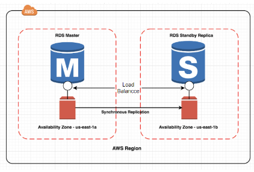

# AWS Infrastructure with Terraform

Infrastructure-as-Code portfolio project that provisions a small web architecture on AWS using Terraform.

It deploys two EC2 web servers in separate Availability Zones behind an Application Load Balancer, plus two private MySQL RDS instances accessible only from the web-server security group.

## Architecture

- **Application Load Balancer** distributes HTTP traffic across two EC2 instances.
- **EC2** instances run Apache in separate Availability Zones.
- **Amazon RDS for MySQL** provides two independent database instances in separate Availability Zones.
- **Security Groups** separate ALB, web-server, SSH and database access.
- **Terraform** manages the infrastructure declaratively.

> This is an educational portfolio project. The two RDS resources are independent database instances, not an RDS Multi-AZ primary/standby deployment.

## Technologies

Terraform · AWS · EC2 · Application Load Balancer · RDS · MySQL · Linux

## Security and maintainability

The original academic project was modernized for portfolio use:

- AWS credentials are not Terraform variables; authentication uses the standard AWS credential chain.
- SSH is restricted with the ssh_allowed_cidr variable and rejects 0.0.0.0/0.
- The ALB and EC2 instances use separate security groups.
- MySQL is reachable only from the EC2 security group.
- RDS is private and storage encryption is enabled.
- The database password is a sensitive Terraform input.
- The EC2 AMI is discovered dynamically rather than hardcoded.
- Terraform and AWS provider versions are declared.

## Prerequisites

- Terraform >= 1.5
- AWS CLI configured for your own AWS account
- An SSH public key
- Permission to create the AWS resources used by this project

Do not commit AWS credentials, database passwords or private SSH keys.

## Usage

Clone and initialize:

    git clone https://github.com/keiyanishio/Projeto_Cloud.git
    cd Projeto_Cloud
    terraform init

Create a local terraform.tfvars file containing ssh_public_key, ssh_allowed_cidr, db_username and db_password. Keep that file out of Git.

Then:

    terraform fmt -check
    terraform validate
    terraform plan
    terraform apply

Terraform outputs the load balancer DNS, EC2 public IPs and RDS endpoints.

When finished:

    terraform destroy

This avoids leaving chargeable AWS resources running.

## Project structure

- alb.tf — Application Load Balancer and target group
- az.tf — Availability Zones and default subnets
- instance.tf — EC2 web servers
- key_pairs.tf — SSH public key
- output.tf — Terraform outputs
- providers.tf — Terraform and AWS provider configuration
- rds1.tf / rds2.tf — MySQL RDS instances
- securitygroup.tf — ALB, EC2 and database security groups
- subnetsgroup.tf — RDS subnet group
- variable.tf — input variables

## Next improvements

For a production-oriented evolution of this architecture: dedicated VPC and private subnets, HTTPS with ACM, AWS Systems Manager instead of SSH, Secrets Manager, autoscaling, monitoring and a true RDS Multi-AZ deployment.
