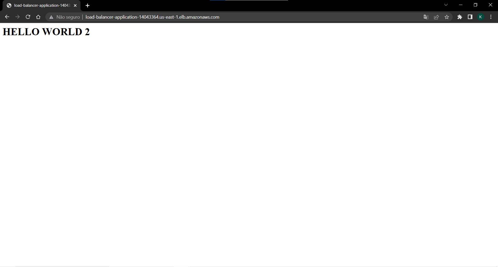
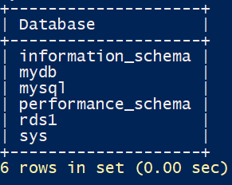

# AWS Infrastructure with Terraform

Academic Infrastructure-as-Code project developed in **2023** during my Computer Engineering degree at Insper.

The project was created to practice provisioning AWS infrastructure with Terraform. The original implementation deployed two EC2 web servers in separate Availability Zones behind an Application Load Balancer, together with two MySQL RDS instances.

## Architecture

The project contains:

- **Application Load Balancer (ALB)** to distribute HTTP traffic between the web servers.
- **Two EC2 instances** running Apache, deployed across separate Availability Zones.
- **Two Amazon RDS for MySQL instances**, also placed in separate Availability Zones.
- **Security Groups** controlling HTTP, SSH and MySQL connectivity.
- **Terraform** to provision the AWS resources as code.

> The two RDS resources are independent database instances. They are not an RDS Multi-AZ primary/standby deployment.

## Technologies

**Terraform · AWS · EC2 · Application Load Balancer · RDS · MySQL · Linux**

## Project history

This project was originally developed and deployed in **2023** as part of my Computer Engineering coursework at Insper.

The screenshots included in this repository document the infrastructure running at the time, including the two web servers behind the load balancer and access to the database.

The Terraform source code has intentionally been preserved as the **original 2023 implementation**. The AWS environment and credentials used for the academic project are no longer available, so the infrastructure has not been redeployed or revalidated against AWS since then.

## Original results

The Application Load Balancer distributed requests between the two EC2 web servers:

The EC2 instances could connect to the MySQL RDS instances:

## Repository structure

- `alb.tf` — Application Load Balancer, listener and target group
- `az.tf` — Availability Zones and default subnets
- `instance.tf` — EC2 web servers and bootstrap scripts
- `key_pairs.tf` — SSH public key configuration
- `output.tf` — Terraform outputs
- `providers.tf` — AWS provider configuration
- `rds1.tf` / `rds2.tf` — MySQL RDS instances
- `securitygroup.tf` — network access rules
- `subnetsgroup.tf` — RDS subnet groups
- `variable.tf` — Terraform input variables

## What I would improve today

If I were rebuilding this architecture today, I would keep the original learning goals but update several implementation choices:

- Use the standard AWS credential chain instead of passing AWS access keys as Terraform variables.
- Restrict SSH access rather than allowing port 22 from `0.0.0.0/0`, or use AWS Systems Manager instead of SSH.
- Use separate Security Groups for the ALB and EC2 instances.
- Use a dedicated VPC with public/private subnet design rather than relying on the default VPC.
- Keep database instances private and use a secrets-management solution for credentials.
- Use a dynamically selected/current AMI instead of a hardcoded AMI ID.
- Pin compatible Terraform and AWS provider versions.
- Consider HTTPS, monitoring, autoscaling and a true RDS Multi-AZ configuration for a production-oriented architecture.

These items are documented as **future improvements only**; they are not presented as features implemented in the original 2023 project.

## Note

This repository is preserved primarily as a record of an early cloud-infrastructure project and of my hands-on introduction to Terraform and AWS.
